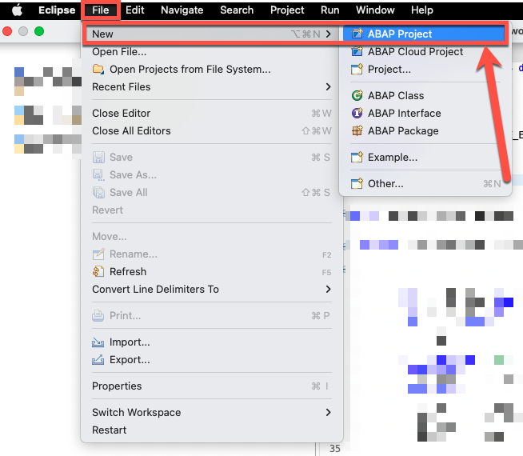
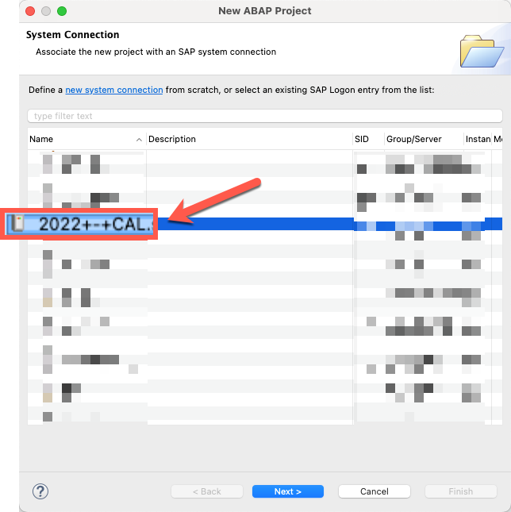
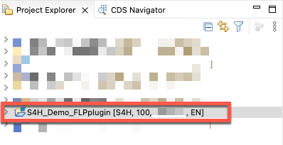

# SETTING UP EMBEDDED STEAMPUNK

## Introduction
In this section you will find the required steps to run the basic setup of Embedded Steampunk. This step is mandatory for you to run the exercise end-to-end.

## Create a new ABAP Project in ADT (Eclipse)
You should start by creating a new ABAP project for your SAP S/4HANA 2022 system. to do this follow the next steps:

1. Create a new project in ADT.

  

2. Select the backend system you will connect to and click **Next**.

  

3. Confirm system connection parameters (or edit as needed) and click **Next**.
  **Note - In this screen you may also create a new connection from scratch.**

  

4. Enter your system Id to setup a connection to the backend system and click **Next**

  

5. Setup a friendly name for your ABAP project (for example: <SID>_Demo_FLPplugin) and click **Finish**.

  

6. Once all steps are run you will find your new project in the **Project Explorer** section in ADT.

  

## Notification Framework
The notification framework is a set of standarized ABAP classes and services which control the creation, deployment and maintenance of notifications in the SAP ABAP stack. Amongst the most important features provided by the framework we can list the following:

### Transactions:

## Notification Provider
A notification provider is a standard or custom ABAP class in your SAP S/4HANA system based on standard interface: /IWNGW/IF_NOTIF_PROVIDER.

Development of a custom notification provider implies leveraging a standard inerface meaning a set of standard methods must be implemented on your own for the notifications to work correctly. A brief description of each of these methods is provided:

-	/IWNGW/IF_NOTIF_PROVIDER~GET_NOTIFICATION_PARAMETERS: Returns notification instance specific parameters (defined in the payload). These parameters are combined with text templates (text message) to form the text of a notification.
-	/IWNGW/IF_NOTIF_PROVIDER~GET_NOTIFICATION_TYPE: Returns metadata related to the notification type like Provider ID, available notification parameters and actions.
-	/IWNGW/IF_NOTIF_PROVIDER~GET_NOTIFICATION_TYPE_TEXT: Returns language dependent text related to the notification type, including text templates and action texts.
-	/IWNGW/IF_NOTIF_PROVIDER~HANDLE_ACTION: Required when notification allows end users to trigger actions (defined in GET_NOTIFICATION_TYPE).

  

For more information on Notification Providers click on this [link](https://help.sap.com/viewer/68bf513362174d54b58cddec28794093/202110.000/en-US/80331a1a19464223897f9bd60584461f.html).

## Next Steps
To continue with this exercise go to [Exercise 1](../ex_2)
