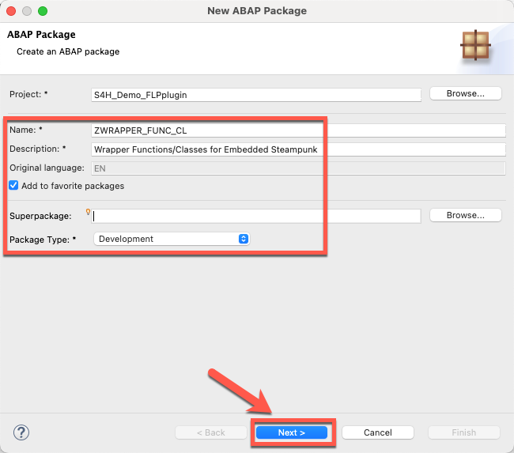
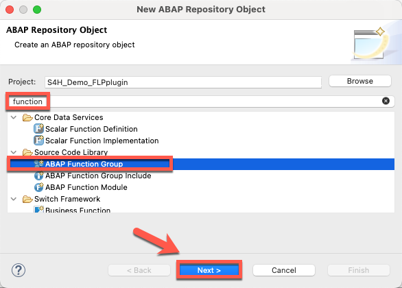

# CREATING A BACKEND FUNCTION MODULE TO EXPOSE SYSTEM DETAILS

## Introduction
In this section you will find the steps to create a wrapper function module to be later consumed via code in Embedded Steampunk. Overall, you will be creating classic extensibility objects you are already familiar with like packages and function modules.

## Create a custom development package for Classic Developments
To create this custom development package follow the next steps:

25. In the **Project Explorer**, right-click on the ABAP Project for your development system and from the menu, select **New >> ABAP Package**.

  

26. Enter the following information and click **Next**:
  * Name: **<< Your package name >>** (for example: ZWRAPPER_FUNC_CL).
  * Description: **<< Your package description >>** (for example: Wrapper Functions/Classes for Embedded Steampunk).
  * Package Type: **Development**

  

27. Enter the software component where this objects will be allocated and click **Next**.
  * Software Component: **HOME**

  

28. Select an existing transport request or create a new one to save your changes and click **Finish**

  

29. Once created, package details will be displayed in the screen.

  

## Create a custom function module
30. In **Project Explorer**, expand **Favorite Packages** and right-click on your recently created development package. From the menu select **New >> Function Module**

  

31. Enter the following information and click **Next**:
  * Name: **<< Your package name >>**
  * Description: **<< Your package description >>**

  

32. Select an existing transport request or create a new one to save your changes and click **Finish**

  

33. Once created, your new function module will be displayed in the screen.

  

## Next Steps
In the next section you will create the second object in our custom development architecture: **a Custom HTTP Service (number 2 in the diagram)**.

  

To continue with this exercise go to [Exercise 3](../ex_3)
