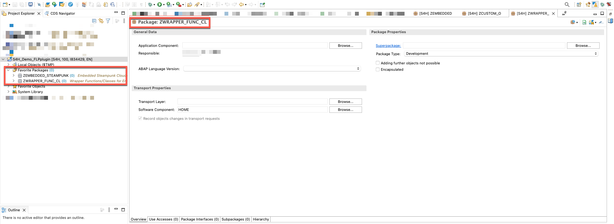
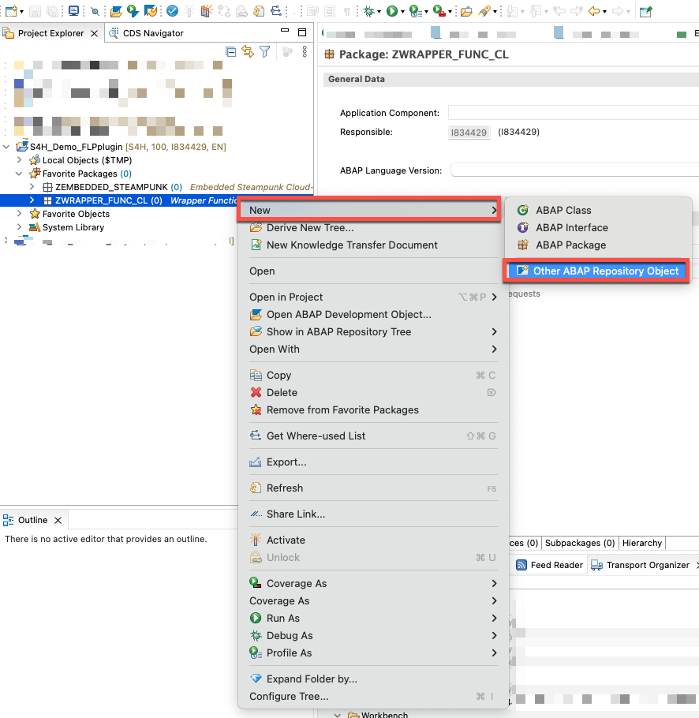
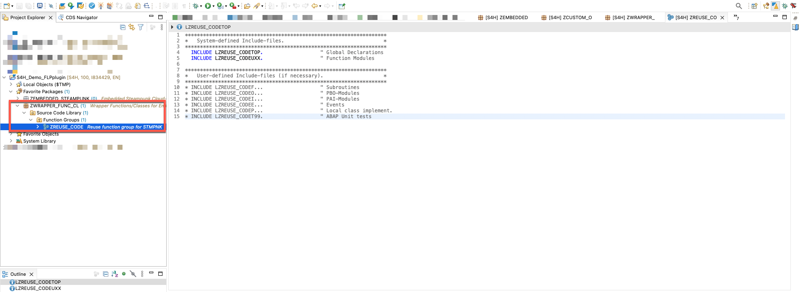
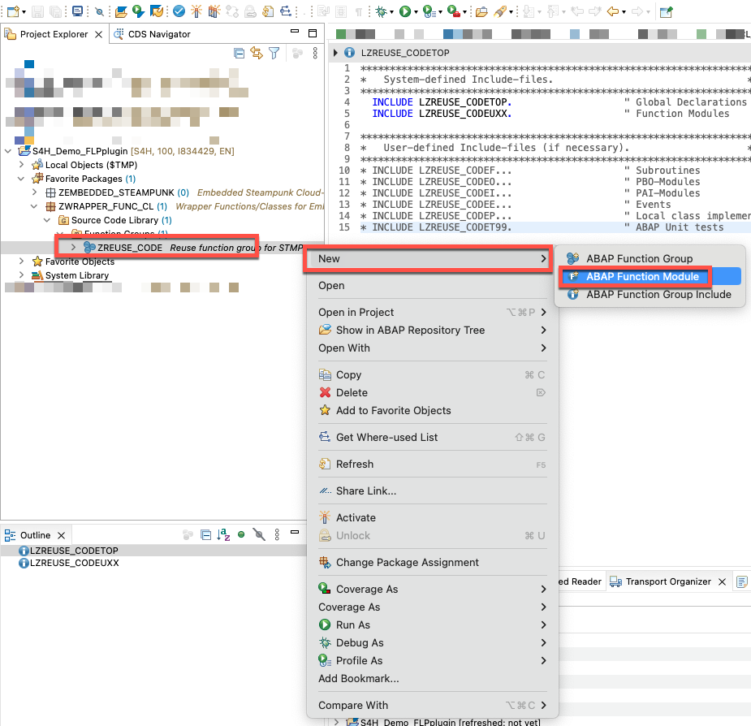
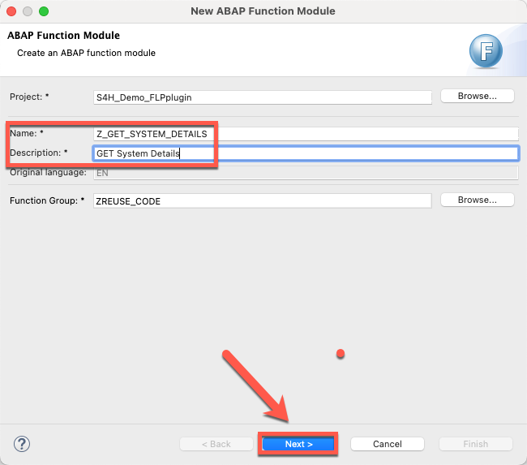
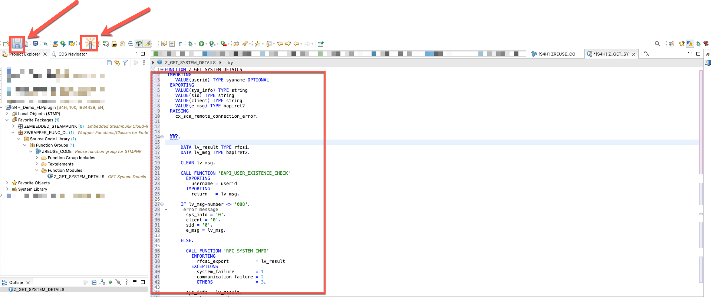
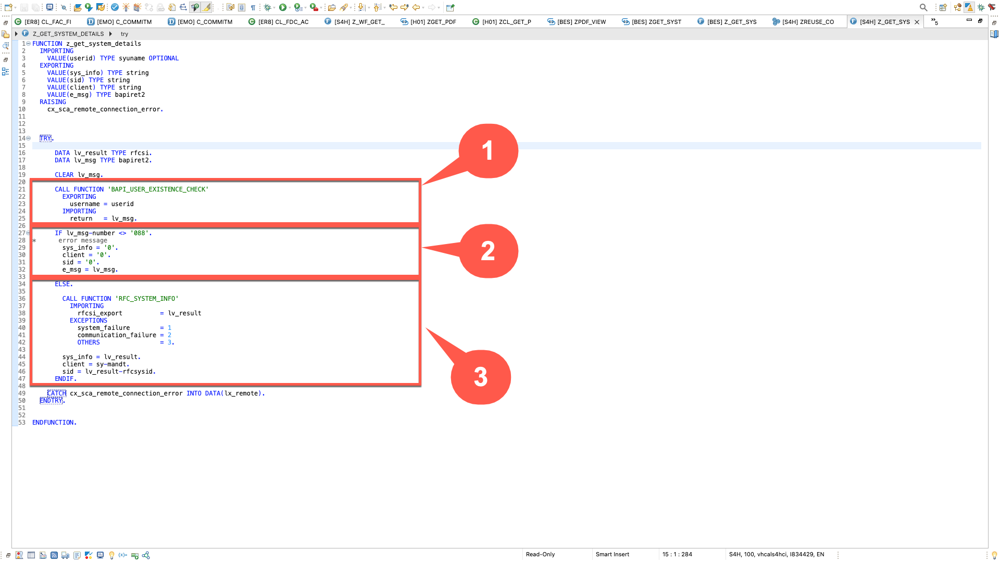
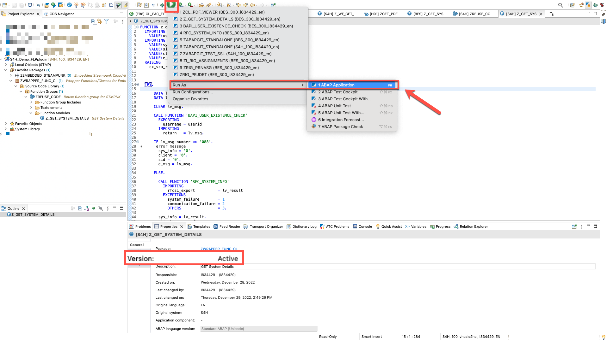
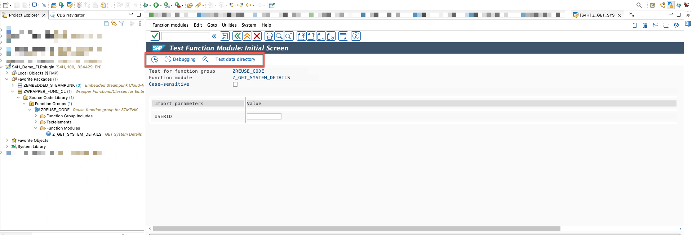

# CREATING A BACKEND FUNCTION MODULE TO EXPOSE SYSTEM DETAILS

## Introduction
In this section you will find the steps to create a wrapper function module to be later consumed via code in Embedded Steampunk. Overall, you will be creating classic extensibility objects you are already familiar with like packages and function modules.

## Create a custom development package for Classic Developments
To create this custom development package follow the next steps:

25. In the **Project Explorer**, right-click on the ABAP Project for your development system and from the menu, select **New >> ABAP Package**.

  

26. Enter the following information and click **Next**:
  * Name: **<< Your package name >>** (for example: ZWRAPPER_FUNC_CL).
  * Description: **<< Your package description >>** (for example: Wrapper Functions/Classes for Embedded Steampunk).
  * Add to favorite packages: **Active**
  * Superpackage: **Blank**
  * Package Type: **Development**

  

27. Enter the software component where this objects will be allocated and click **Next**.
  * Software Component: **HOME**

  

28. Select an existing transport request or create a new one to save your changes and click **Finish**

  

29. Once created, package details will be displayed in the screen.

  **NOTE** - Your new package should also appear under the **Favorite Packages** folder.

  

## Create a custom function module
Now that you have a package to store your custom backend classic objects you will start creating a new function module.

30. In **Project Explorer**, expand **Favorite Packages** and right-click on your recently created development package (ZWRAPPER_FUNC_CL) and from the menu select **New >> Other ABAP Repository Object**

  

31. In the dialog screen, search for term "Function". Once results are shown, select entry **ABAP Function Group** and click **Next**.

  

32. Enter the following information and click **Next**:
  * Name: **<< Your function group name >>** (for example: ZREUSE_CODE)
  * Description: **<< Your function group description >>** (for example: Reuse function group for STMPNK)

  

33. Select an existing transport request or create a new one to save your changes and click **Finish**

  

34. Once created, your new function group will be displayed in the screen.

  **NOTE** - Try expanding the package hierarchy in the **Favorite Packages** section

  

35. In **Project Explorer**, under your package hierarchy, right-click on your Function Group (ZREUSE_CODE) and select **New >> ABAP Function Module**

  

36. Enter the following information and click **Next**:
  * Name: **<< Your function module name >>** (for example: Z_GET_SYSTEM_DETAILS)
  * Description: **<< Your function module description >>** (for example: GET System Details)

  

37. Select an existing transport request or create a new one to save your changes and click **Finish**

  

38. Once created, your new function module will be displayed in the screen. Copy the code from our [sample file](sources/Z_GET_SYSTEM_DETAILS.abap) and once copied **Save** and **Activate**

  

## What does this code do?
In this section we will briefly explain what the copied code is doing.

  

39.1. In section "1" we are calling a function to validate if the input parameter (User ID) exists in the system, meaning we are checking if the provided User ID exists in the system
39.2. In section "2" we are validating the response from the previous function call and validating if response code "088" is received, if this is the case it means the User ID does not exist in the system hence we setup the return values to "0" and forward the standard error message.
39.3. In section "3" if we know the User ID exists in the system, we call a second function to retrieve system information and pass the values as a response.

This simple function will be used by the SAP Fiori Launchpad plugin to show the System ID and Client number to the end-user.

## Test the code
In this section we will briefly explain how to test the code.

40. Once the function module is active, click on **Run >> Run As >> ABAP Application** or press **F8**.

  

41. Classic Test Workbench will be displayed, test your function module as needed.

  

## Next Steps
In the next section you will create the second object in our custom development architecture: **a Custom HTTP Service (number 2 in the diagram)**.

  

To continue with this exercise go to [Exercise 3](../ex_3)
