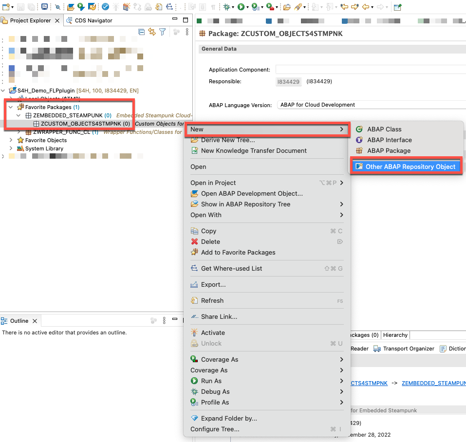
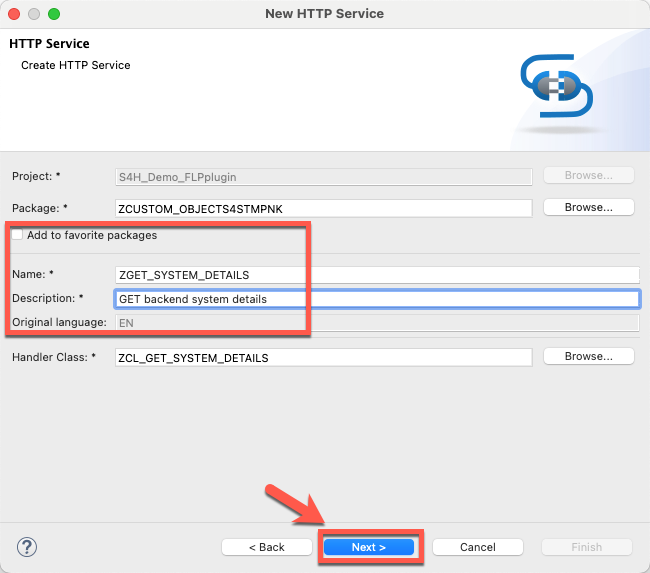
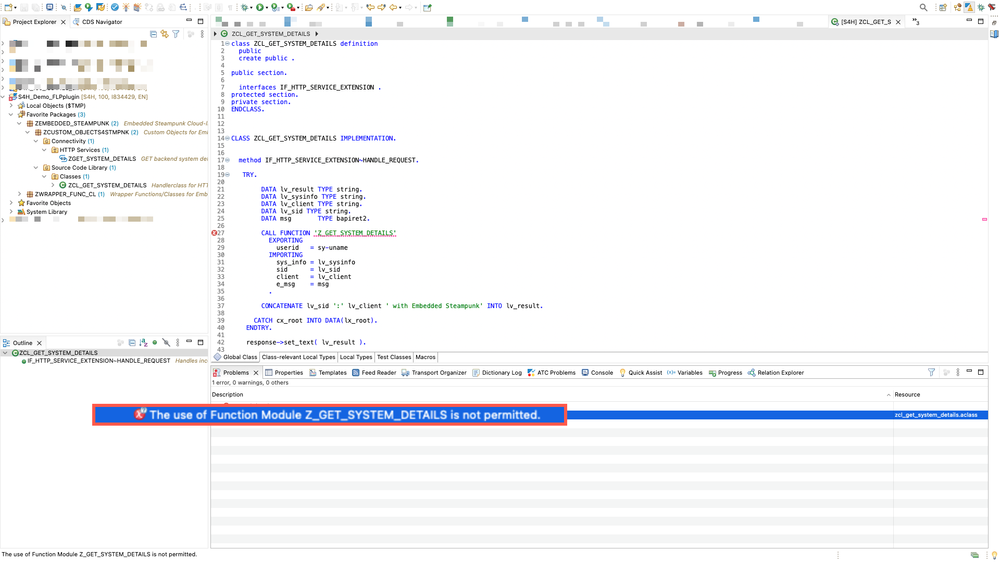

# CREATING AN HTTP SERVICE

## Introduction
In this section you will find the steps to create an HTTP Service in Embedded Steampunk which you cal later call from your browser

## Create a custom HTTP Service in Embedded Steampunk
To create this custom HTTP Service, you would need to work in the Embedded Steampunk development package you created earlier as part of [Exercise 1](../ex_1#create-a-custom-development-package-for-your-embedded-steampunk-custom-developments).

42. In **Project Explorer**, right-click on the ABAP Package **"ZCUSTOM_OBJECTS4STMPNK"**. From the menu, select **New >> Other ABAP Repository Object**.

  

43. In the dialog window, search for keyword: "Service". Once results are displayed, select entry **HTTP Service** and click **Next**.

  

44. Enter the following information and click **Next**:
  * Name: **<< Your custom HTTP service name >>** (for example: ZGET_SYSTEM_DETAILS).
  * Description: **<< Your custom HTTP service  description >>** (for example: GET Backend System Details).
  * Add to favorite packages: **Inactive**

  **NOTE** - The value in parameter **Handler Class** will be updated automatically, do not modify this value.

  

45. Select an existing transport request or create a new one to save your changes and click **Finish**

  

46. On successful creation you will notice two objects have been generated: an HTTP service and a Handler Class. Navigate to the Handler Class by clicking on text "Handler Class".

  

47. Copy the code from our [sample](sources/ZCL_GET_SYSTEM_DETAILS.abap) into this handler class. **Save** and **Activate**.

  

48. When trying to activate a critical error will be displayed which would not allow you to activate this object.

  

  **NOTE** - The error is generated because the most important step to consume the backend wrapper is missing. In the next section you will find how to add a Release Contract to the backend wrapper function module. Be aware that when coding in Embedded Steampunk, you may only consume "cloud-released" objects.

## Adding a Release Contact
In this section we will briefly explain what the copied code is doing.

## What does this code do?
In this section we will briefly explain what the copied code is doing.

## Test the code
In this section we will briefly explain how to test the code.

## Next Steps
In the next section you will create the second object in our custom development architecture: **a Custom Fiori Launchpad Service (number 2 in the diagram)**.

  

To continue with this exercise go to [Exercise 4](../ex_4)
