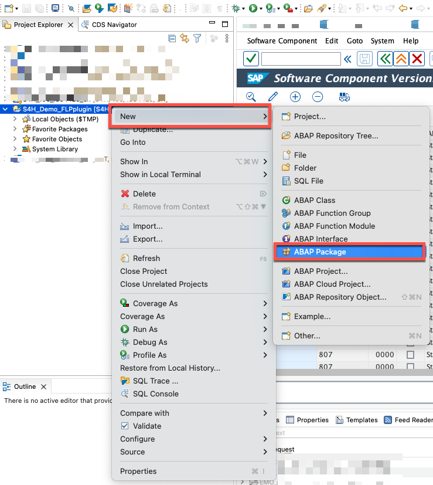

# CREATING AN HTTP SERVICE

## Introduction
In this section you will find the steps to create an HTTP Service in Embedded Steampunk which you cal later call from your browser

## Create a custom HTTP Service in Embedded Steampunk
To create this custom development package follow the next steps:

42. In the **Project Explorer**, right-click on the ABAP Project for your development system and from the menu, select **New >> ABAP Package**.

  

26. Enter the following information and click **Next**:
  * Name: **<< Your package name >>** (for example: ZWRAPPER_FUNC_CL).
  * Description: **<< Your package description >>** (for example: Wrapper Functions/Classes for Embedded Steampunk).
  * Add to favorite packages: **Active**
  * Superpackage: **Blank**
  * Package Type: **Development**

  

27. Enter the software component where this objects will be allocated and click **Next**.
  * Software Component: **HOME**

  

28. Select an existing transport request or create a new one to save your changes and click **Finish**

  

29. Once created, package details will be displayed in the screen.

  **NOTE** - Your new package should also appear under the **Favorite Packages** folder.

  

## Adding a Release Contact
In this section we will briefly explain what the copied code is doing.

## What does this code do?
In this section we will briefly explain what the copied code is doing.

## Test the code
In this section we will briefly explain how to test the code.

## Next Steps
In the next section you will create the second object in our custom development architecture: **a Custom Fiori Launchpa Service (number 2 in the diagram)**.

  

To continue with this exercise go to [Exercise 3](../ex_3)
