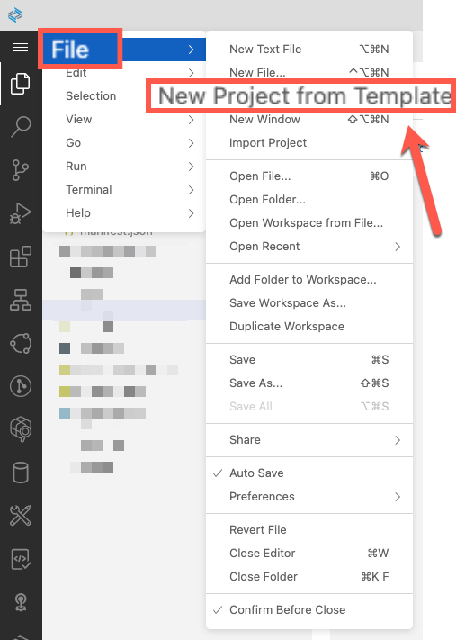
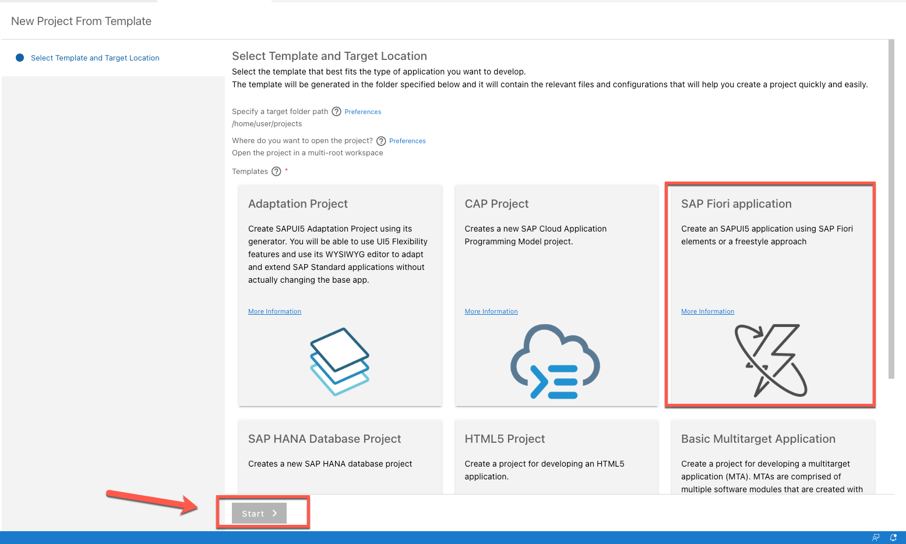
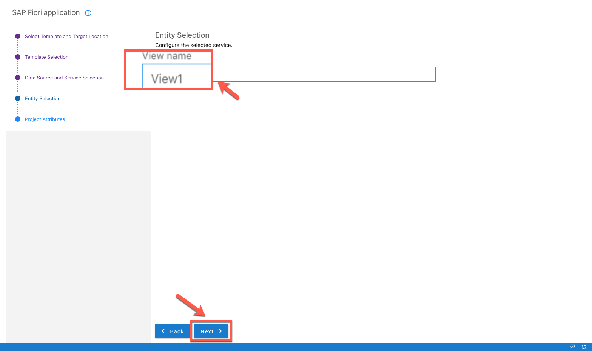

# CREATING AND DEPLOYING AN SAP FIORI LAUNCHPAD PLUGIN IN SAP BUSINESS APPLICATION STUDIO

## Introduction
In this section you will find the required steps to create a new SAP Fiori Launchpad Plugin project in SAP Business Application Studio.

## Create a new BAS project
You should start by creating a new BAS project using the standard project generators for a freestyle application. To do this follow the next steps:

61. Launch BAS. Once loaded, go to **File >> New Project from Template**.

  

62. Select **SAP Fiori Application** generator and click on **Start**

  

63. Select **SAPUI5 freestyle** from **application type** dropdown, followed by selecting the **SAPUI5 Application** generator and clicking on **Next**.

  

64. Select **Data source = None** and click on **Next**.

  

65. Use default value for field **View name** and click on **Next**.

  

66. Enter the following details and click on **Finish**:

| **Parameter**                 | **Value**                                                                        |
|-------------------------------|------------------------------------------------------------------------------|
| Module Name:                  | **< Your plugin module name >** (for example: **flpplugindemo**)               |
| Application Title:            | **< Your plugin title >** (for example: **FLPplugin demo**)                    |
| Application Namespace:        | **< Your plugin namespace >** (for example: **com.sap.rig.demoplugin**)        |
| Description:                  | **< Your plugin description >** (for example: **A Fiori plugin**)              |
| Project folder path:          | **< Your project root folder in BAS >** (for example: **/home/user/projects**) |
| Minimum SAPUI5 version:       | **< Your backend system SAPUI5 library version >** (for example: **1.109.3**)  |
| Add deployment Configuration: | **No**                                                                       |
| Add FLP configuration         | **No**                                                                       |
| Configure advanced options    | **No**                                                                       |

  

## Adapt Generated Project
The generated project is created as a freestyle application, meaning it is considering navigation routers, controllers and views to be displayed as an SAP Fiori app. Unfortunately, in our case we need to create an SAP Fiori Launchpad Plugin, which is the simplest form of an app and is actually called a **Component**.

Follow the next steps to adjust the current project structure to behave as an SAP Fiori Component.

## Adapt Component.js and Manifest.json files
In this section you will modify the manifest.json and component.js files to setup the SAP Fiori Launchpad plugin and include business logic to make a call to your custom HTTP service (created in [Exercise 3](../ex_3))

## What does this code do?
In this section we will briefly explain what the copied code is doing.

## Next Steps
In the next section you will activate your custom SAP Fiori Launchpad Plugin on your ABAP platform.

To continue with this exercise go to [Exercise 5](../ex_5)
